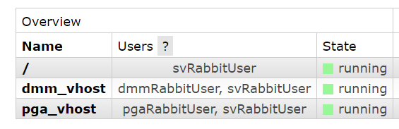
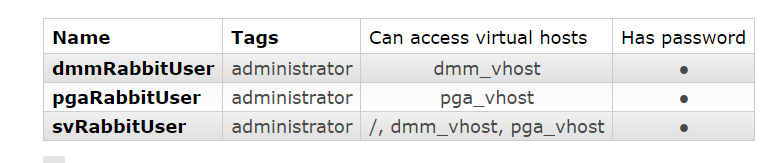
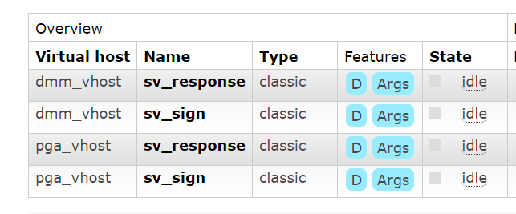

# RabbitMQ multiple virtual host spring boot


## Configuration on Rabbit

#### virtual hosts --



#### rabbit users --



#### queues --



## On Spring boot
### Publisher
Setting up a `SimpleRoutingConnectionFactory` as following --

```java
@Bean
    public ConnectionFactory connectionFactory() {
        SimpleRoutingConnectionFactory routingConnectionFactory = new SimpleRoutingConnectionFactory();
        Map<Object, ConnectionFactory> targetConnectionFactories = new HashMap<>();
        targetConnectionFactories.put("dmm_vhost", dmm_vhost_ConnectionFactory());
        targetConnectionFactories.put("pga_vhost", pga_vhost_ConnectionFactory());
        routingConnectionFactory.setTargetConnectionFactories(targetConnectionFactories);
        return routingConnectionFactory;
    }
```

the targetConnectionFactories has to define all the other v-host connections :-

```java
private ConnectionFactory dmm_vhost_ConnectionFactory() {

        CachingConnectionFactory connectionFactory = new CachingConnectionFactory();
        connectionFactory.setHost("localhost");
        connectionFactory.setVirtualHost("dmm_vhost");
        connectionFactory.setUsername("dmmRabbitUser");
        connectionFactory.setPassword("guest");
        return connectionFactory;
    }

    private ConnectionFactory pga_vhost_ConnectionFactory() {

        CachingConnectionFactory connectionFactory = new CachingConnectionFactory();
        connectionFactory.setHost("localhost");
        connectionFactory.setVirtualHost("pga_vhost");
        connectionFactory.setUsername("pgaRabbitUser");
        connectionFactory.setPassword("guest");
        return connectionFactory;
    } 
```
Now, while publishing, we need to mention which virtual host we want to publish to --

```java
SimpleResourceHolder.bind(rabbitTemplate.getConnectionFactory(), "<VHOST_NAME>");
rabbitTemplate.convertAndSend("<EXCHANGE>", "<ROUTING_KEY>", "<PAYLOAD>");
```

### Consumer

Individual listeners needed to be setup for each individual V_Hosts

```java
@Bean("dmmSignListener")
    MessageListenerAdapter dmmListenerAdapter(ConsumerService consumerService) {
        return new MessageListenerAdapter(consumerService, "dmmReceiveSignMessage");
    }
    @Bean("pgaSignListener")
    MessageListenerAdapter pgaListenerAdapter(ConsumerService consumerService) {
        return new MessageListenerAdapter(consumerService, "pgaReceiveSignMessage");
    }

    @Bean("dmmSignListenerContainer")
    public SimpleMessageListenerContainer dmmSignListenerContainer(@Qualifier("dmmSignListener") MessageListenerAdapter listenerAdapter) {
        SimpleMessageListenerContainer container = new SimpleMessageListenerContainer();
        container.setConnectionFactory(dmm_vhost_ConnectionFactory());
        container.setQueueNames("sv_sign");
        container.setMessageListener(listenerAdapter);
        return container;
    }

    @Bean("pgaSignListenerContainer")
    public SimpleMessageListenerContainer pgaSignListenerContainer(@Qualifier("pgaSignListener") MessageListenerAdapter listenerAdapter) {
        SimpleMessageListenerContainer container = new SimpleMessageListenerContainer();
        container.setConnectionFactory(pga_vhost_ConnectionFactory());
        container.setQueueNames("sv_sign");
        container.setMessageListener(listenerAdapter);
        return container;
    }

```
### How to run this project

```sh
./mvnw spring-boot:run
```


